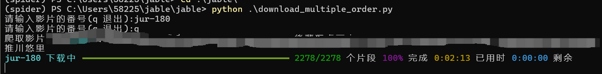

# Jable Video Downloader

一个基于 **Selenium + undetected-chromedriver** 的视频下载器，支持自动抓取 `.m3u8` 文件并批量下载 `.ts` 分片，合并为 `.mp4` 文件，同时支持 GPU 编码（NVIDIA h264_nvenc）。

---

## 功能 ✨
- 自动启动浏览器（支持 headless 模式），抓取目标视频的 m3u8 链接  
- 解析 m3u8，下载所有 ts 文件，支持断点续传 & 多线程下载  
- 自动合并 ts 文件为单个 `.ts` 文件  
- 调用 **ffmpeg** 转码为 `.mp4`（可选 GPU 加速）  
- 多进程支持：可同时下载多个番号  
- 日志：基于 `rich`，彩色输出 + 进度提示  

---

## 环境要求 🛠
- Python 3.8+  
- Chrome 浏览器  
- 已安装 [ffmpeg](https://ffmpeg.org/download.html) 并添加到系统 PATH  

---

## 安装 📦

```bash
git clone https://github.com/yourname/jable-downloader.git
cd jable-downloader
pip install -r requirements.txt
```

## 使用

### 单个视频

番号位置


```bash
python download.py
```

### 多个视频

```bash
python download_multiple_order.py
```

下载过程采用rich库更直观



### 注意事项

每一个文件存在一个ROOT,修改保存的位置

可以配合[movie Data Caputer](https://github.com/mvdctop/Movie_Data_Capture)刮削进行数据库整理.

由于ffmpeg转码的设置,每一个视频文件大约有10-15GB,如果进度条跑完还没有到下一个,不要担心,ffmpeg在转码.

## 未来计划

- [x] 支持 m3u8 解析
- [x] 多线程下载 TS
- [ ] 支持断点续传
- [ ] 集成 GUI 界面
- [ ] 多进程下载多个影片

[](https://star-history.com/#torvalds/linux&Date)

